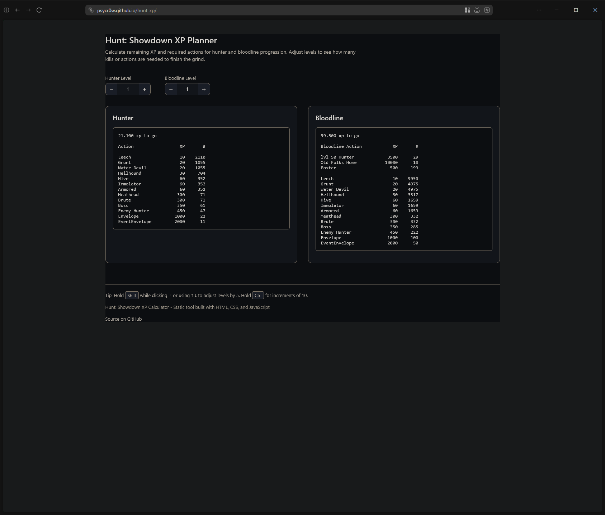

# Hunt: Showdown XP Calculator

Small web-based calculator for estimating how many actions are required to reach the next Hunter or Bloodline level in **Hunt: Showdown**.

Originally written as a Python CLI/GUI tool, this version runs entirely in the browser and can be hosted as a static site.

---

## Features

* Live updates while typing
* Calculates remaining XP for:

  * Hunter levels (1–50)
  * Bloodline levels (1–100)
* Shows how many actions are required to reach the next level
* Includes special Bloodline actions:

  * Level 50 Hunter
  * Retirement
  * Poster

No backend. No dependencies. Just HTML, CSS, and JavaScript.

---

## Screenshot



---

## Running locally

You can simply open the page in a browser:

```bash
xdg-open index.html
```

Or serve it with any static web server.

Example using Docker + nginx:

```bash
docker run -d \
  -p 8080:80 \
  -v $(pwd):/usr/share/nginx/html:ro \
  nginx
```

Then open:

```
http://localhost:8080
```

---

## Deployment

Since this is a static site, it works on any static host:

* GitHub Pages
* nginx
* Traefik
* Netlify
* Cloudflare Pages

Just upload:

```
index.html
data.js
logic.js
```

---

## Data Sources

XP values are based on Hunt: Showdown in-game progression data.
Data has been collected by [Tobias Kunz](https://github.com/ChubbyPandaAT) and myself, logic and website has been written by myself.

If Crytek changes XP values in future updates or events, the values in `data.js` may need to be updated.

---

## License

MIT

